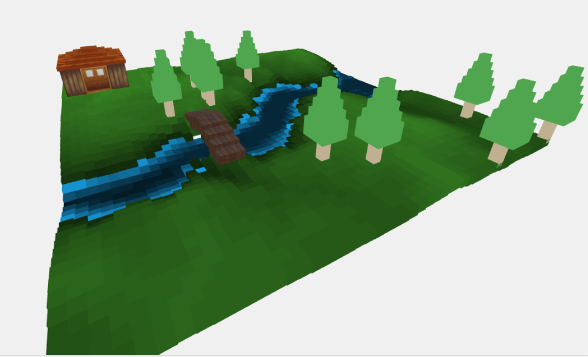
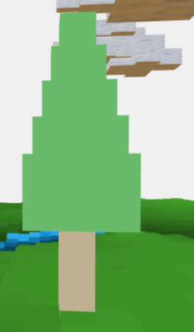
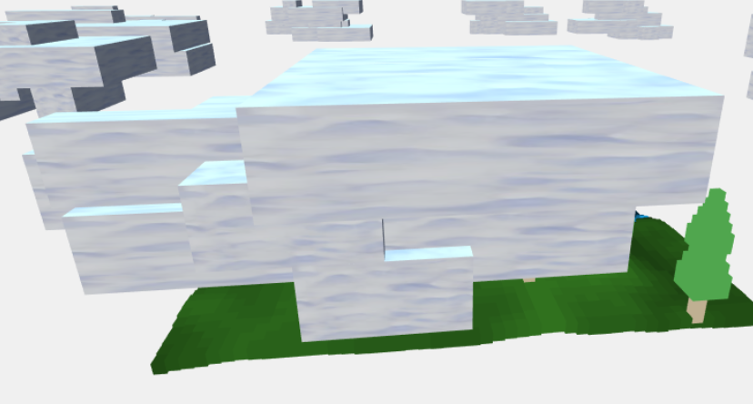
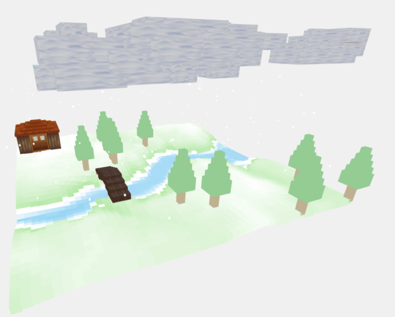

# Interactive 3D Graphics - Primo progetto

## Autore
Massimiliano Gaio, 132588.

## Descrizione generale
Il seguente progetto presenta un ambiente, interamente creato da cubi, che rappresenta una porzione di territorio coperto di erba e attraversato da un fiume su cui sono posizionati una casetta ed un ponte e dei pini.

La scena, inoltre, genera delle nuvole in movimento, che ciclicamente attraversano l'ambiente appena descritto. Quando questo avviene, la scena introduce una nevicata che imbianca il prato, i pini e giacca il fiume. Successivamente allo spostamento delle nuvole, le neve si scioglie e l'ambiente ritorna alla forma originale.

La caratteristica principale della scena è la pseudo-casualità. Infatti, la posizione dei pini e delle nuvole, nonchè la struttura e movimento di queste ultime risultano generati secondo un algoritmo randomico ad ogni creazione della scena. 

## Risultati
Il terreno risultante dal caricamento della scena è il seguente


Gli elementi naturali che compongono l'ambiente e che non sono integrati nella generazione automatica del terreno sono i pini, le nuvole e i fiocchi di neve. Di seguito sono riportati le immagini di questi elementi.
 
 
 
 
L'ultima immagine permette anche di osservare i cambiamenti del terreno nel momento in cui vegnono introdotti i fiocchi di neve.

## Implementazione
Come da consegna il terreno è stato generato a partire da un'immagine in scala di grigi. Tramite l'algoritmo che assegna una diversa altezza ad ogni cubo secondo il corrispondente pixel dell'immagine, è stato assegnato anche un colore diverso dipendente da tale altezza. In questo modo i pixel più scuri hanno ricoperto il ruolo del fiume (assegnando ai relativi blocchi il colore blu), mentre gli altri sono stati utilizzato come prato, assegnando diverse sfumature di verde ai cubi. 
Come accennato in precedenza, gli elementi che vengono inseriti nella scena (da oggetti.js) vengono collcati pseudo-casualmente tramite il metodo ```creaPosizione()```. Visto che il terreno presenta delle altezza diverse e che non è possibile sapere in quali posizioni i pini saranno disposti, è indispensabile utilizzare delle strutture dati di supporto per impostare correttalmente la coordinata Y dei pini.
Anche la creazione delle nuvole permette sia di collocare la partenza e arrivo del tragitto in maniera non arbitraria ma, tramite delle scalature e traslazioni dei cubi che la compongono, anche la forma cambia ad ogni creazione della scena. 

La gestione delle animazioni è affidata al metodo ```Update()```. Il ciclo di animazione è scandito, non dai frame, ma dai secondi trascorsi (tramite la funzione ```Date.now()```). In base al tempo trascorso vengono richiamate le funzioni presenti in ```animazioni.js```, che rendono la scena dinamica tramite l'utilizzo di traslazioni e modifica dei materiali che costituisce l'ambiente. Il ciclo di animazione inizia con il movimento delle nuvole verso una posizione all'interno del terreno. Successivamente, vengono aggiunti alla scena i fiocchi di neve, che erano già stati inzializzati alla creazione della scena. Queste due animazioni fanno riferimento a semplici traslazioni, che si basano sul confronto della posizione attuale dell'elemento con la posizione di arrivo. Un altro tipo di animazione presente è la creazione del terreno innevato. L'effetto viene raggiunto con la modifica della tonalità di colore del terreno. Quando il ciclo di animazione è completato, vengono aggiornati i tempi di inizio delle animazioni, così che un nuovo ciclo possa partire.
